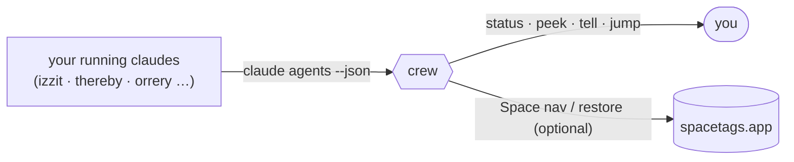

# kaolin's Homebrew tap

One-line installs for my tools:

```
brew install kaolin/tap/<tool>
```

---

## crew — a control panel for your fleet of Claude Code sessions

Run a lot of `claude` sessions by hand — spread across terminal windows and macOS
Spaces — and lose track of them? **crew is htop + a remote for your claudes.** It
doesn't spawn or manage sessions (Claude Code's own Agent view does that) — it
**attaches to the ones you already have** and never disturbs your layout.

- **See everything at a glance** — which sessions are working, idle, or *blocked
  waiting on you* (like the one that's been stuck on a permission prompt for a day).
- **Dispatch without hunting** — send a prompt to any idle session, or jump straight
  to its window *and its Space*.
- **Survive reboots** — snapshot your whole fleet and bring it all back — windows,
  Spaces, *and* conversations — with one command.

### Install

```
brew install kaolin/tap/crew
crew                          # your fleet, grouped by project, needs-you first
brew services start crew      # optional: auto-snapshot every 5 min (reboot safety)
```

macOS + iTerm2. Uses the `claude` CLI (Claude Code). Space-aware jump & restore are
optional, powered by **[spacetags](https://spacetags.app/)**.

### How it works



crew reads Claude Code's own `claude agents --json` for live status, reaches your
iTerm2 windows via `pid → tty`, and hands all macOS-Space navigation to spacetags.
No background daemon of its own beyond the optional snapshot tick.

### Commands

| command | what it does |
|---|---|
| `crew` · `crew status` | fleet overview, most-urgent first |
| `crew peek <name>` | read a session's screen (read-only) |
| `crew tell <name> "…"` | send a prompt to an idle session |
| `crew jump <name>` | switch to its Space + front its window |
| `crew snapshot` · `crew restore` | save / rebuild the whole layout across a reboot |
| `crew setup` · `crew doctor` | install / health-check |

**Full docs & source → [github.com/kaolin/crew](https://github.com/kaolin/crew)**

---

<details>
<summary>Maintainer notes</summary>

### Cutting a crew release

```
cd ~/dev/crew
git tag v0.1.1 && git push origin v0.1.1
curl -sL https://github.com/kaolin/crew/archive/refs/tags/v0.1.1.tar.gz | shasum -a 256
```

Update `Formula/crew.rb`'s `url` + `sha256`, commit + push this repo. Users then
`brew upgrade crew`.

### How a tap works

A tap is a public repo named `homebrew-<name>` (`kaolin/homebrew-tap`, referenced as
`kaolin/tap`). Each `Formula/*.rb` declares where to download, how to install, an
optional launchd `service`, and a `test`. `brew install kaolin/tap/crew` clones the
tap and runs the formula.

</details>
